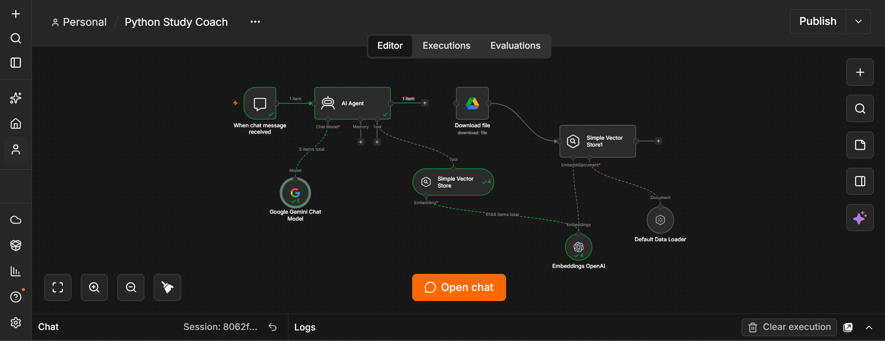
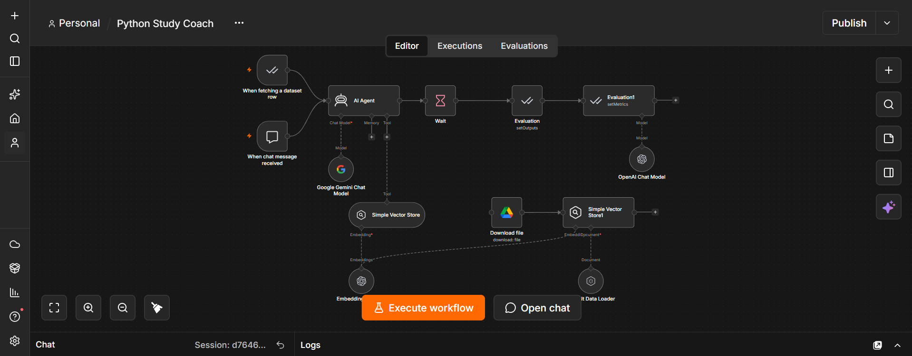
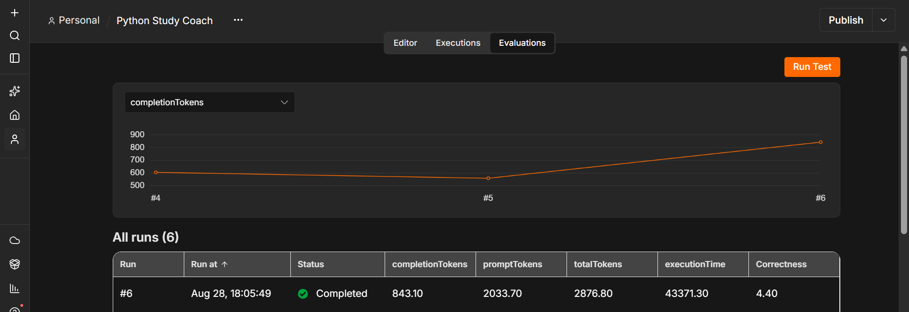

# Python Study Coach — RAG AI Agent

- **Author:** Yumna Kashif
- **Program:** FlyRank AI Internship
- **Track:** AI Fluency
- **Project Type:** AI Study Agent
- **Platform:** n8n
- **Focus:** Python Foundations · RAG · Agent Evaluation

> **Personal Python notes → retrieval-augmented tutoring → evaluated beginner-friendly learning support**

---

## 🔗 Project Links

* 💻 **[GitHub Repository](https://github.com/yumna-09/Python-Study-Coach)**
* ⚙️ **[Main Workflow](workflow/python-study-coach.json)**
* 🧪 **[Evaluation Workflow](workflow/python-study-coach-evaluation.json)**
* 📊 **[Evaluation Dataset](evaluation/python-evaluation-dataset.csv)**

---

## Overview

Python Study Coach is an interactive AI learning agent designed to help beginner Python learners understand concepts, practise problems, and learn from their mistakes.

Rather than behaving like an answer-only chatbot, the agent follows a **teaching-first approach**. It explains concepts in beginner-friendly language, uses small practical examples, provides hints before complete solutions when appropriate, reviews mistakes, and encourages the learner to attempt problems independently.

The agent is connected to a personal Python study-notes knowledge base stored in Google Drive. The notes are processed through an embedding and retrieval pipeline using OpenAI Embeddings and an in-memory vector store, allowing the agent to retrieve relevant learning material when answering questions.

When relevant information is not available in the connected notes, the agent can fall back to general Python knowledge without falsely claiming that the information came from the notes.

---

## The Problem

The question guiding this project was:

> **How can an AI study assistant help a beginner learn Python without simply giving away every answer?**

General-purpose AI assistants can explain programming concepts, but they are not necessarily designed around a learner's current material or learning process.

For a study coach, useful behaviour means more than returning technically correct code. The agent should also:

* explain **why** something works;
* identify mistakes without replacing the learner's thinking;
* use the learner's own notes when relevant;
* provide hints before full solutions when appropriate;
* encourage active problem-solving;
* stay within the intended learning scope.

Python Study Coach was built around these requirements.

---

## Who Is This For?

This project is intended for:

* Beginner Python learners
* Students building programming foundations
* Learners who want explanations rather than answer-only responses
* Students who want an AI tutor connected to their own study material

The original agent was designed around my own Python Foundation study sessions, but the workflow can be reproduced with another learner's study notes.

The current version is intentionally scoped to **Python Foundations** rather than acting as a general-purpose programming assistant.

---

# Results at a Glance

| Result | Value |
| --- | ---: |
| Evaluation test cases | **10** |
| Evaluation method | **AI-based Correctness** |
| Correctness scale | **1–5** |
| **Final V2 correctness** | **4.40 / 5.00** |
| Knowledge source | **Personal Python study notes** |
| Retrieval approach | **RAG** |
| Primary agent model | **Google Gemini** |
| Workflow platform | **n8n** |

The final corrected V2 evaluation produced an average **Correctness score of 4.40 / 5.00** across the 10-question Python Foundations benchmark.

The evaluation compares the Study Coach's generated responses against reference answers for the same test cases.

---

# Project Workflow

## Main RAG Workflow



```text
Learner
   │
   ▼
n8n Chat Trigger
   │
   ▼
Python Study Coach AI Agent
   │
   ├──────────────► Google Gemini Chat Model
   │
   └──────────────► Study Notes Retrieval Tool
                         │
                         ▼
                  Simple Vector Store
                         ▲
                         │
                  OpenAI Embeddings
                         ▲
                         │
                  Python Study Notes
                         ▲
                         │
                     Google Drive
```

The main workflow combines a conversational AI Agent with a retrieval tool so relevant information from the connected Python study notes can be used during tutoring.

---

# Architecture and Design

The system contains two related processes: a **knowledge ingestion pipeline** and an **interactive tutoring pipeline**.

## Knowledge Ingestion Pipeline

```text
Google Drive
     │
     ▼
Python Study Notes
     │
     ▼
Default Data Loader
     │
     ▼
OpenAI Embeddings
     │
     ▼
Simple Vector Store
```

The study material is downloaded from Google Drive and prepared by the Default Data Loader.

OpenAI Embeddings convert the processed material into vector representations, which are inserted into n8n's Simple Vector Store.

## Interactive Tutoring Pipeline

```text
Learner Question
      │
      ▼
   AI Agent
   │      │
   │      └────────► Gemini Chat Model
   │
   └───────────────► Vector Store Retrieval Tool
                           │
                           ▼
                    Relevant Study Notes
                           │
                           ▼
                     Tutor Response
```

A separate Simple Vector Store node is exposed to the AI Agent as a retrieval tool.

The insertion and retrieval vector stores use the same memory key so the agent can search the indexed study material.

This architecture allows the agent to combine conversational generation with retrieved learning context.

---

# Agent Behaviour

The Study Coach is designed to behave like a tutor rather than an automatic solution generator.

It is instructed to:

1. Explain Python concepts in simple, beginner-friendly language.
2. Match the learner's current level.
3. Avoid unnecessarily jumping to advanced topics.
4. Use small, practical examples.
5. Let the learner attempt practice questions before revealing complete solutions when appropriate.
6. Prefer hints and explanations over immediately giving away answers.
7. Identify syntax, logic, and conceptual errors in submitted code.
8. Explain why errors occur.
9. Point out what the learner did correctly as well as what needs improvement.
10. Gradually increase difficulty when the learner demonstrates understanding.
11. Stay focused on Python learning.

For knowledge grounding, the agent uses connected study notes as its primary source when relevant.

A key rule is:

> **The agent must not claim that information came from the learner's notes when it did not.**

---

# Two Knowledge Modes

## 1. Notes-Grounded Mode

When relevant material is available in the connected study notes, the agent uses those notes as its primary learning context.

This allows explanations to stay aligned with the material the learner is currently studying.

## 2. General Python Mode

If the connected notes do not contain the required material, the Study Coach can still respond using general Python knowledge.

In this mode, the agent must not claim that the information came from the learner's study material.

This distinction keeps the coach useful while reducing false source attribution.

---

# Tech Stack

| Component | Role |
| --- | --- |
| **n8n Cloud** | Workflow orchestration and agent interface |
| **n8n AI Agent** | Coordinates the language model and retrieval tool |
| **Google Gemini** | Primary language model for tutoring responses |
| **Google Drive** | External source for the Python study-notes file |
| **Default Data Loader** | Prepares the downloaded study material |
| **OpenAI Embeddings** | Creates vector embeddings for retrieval |
| **Simple Vector Store** | In-memory document storage and retrieval |
| **n8n Evaluations** | Dataset-driven agent evaluation |
| **OpenAI Chat Model** | LLM judge for AI-based Correctness |

---

# Build Iteration

One important implementation change occurred while connecting the study material.

## Initial Approach

The original plan was to read the Markdown study-notes file directly from the local computer.

However, the workflow was running on **n8n Cloud**, which could not directly access the local computer's filesystem.

## Problem

```text
Local Markdown File
        ✕
    n8n Cloud
```

The local file therefore could not serve as a reliable data source for the cloud workflow.

## Solution

The study-notes file was moved to **Google Drive**, and the workflow was updated to download it through the Google Drive integration.

```text
Google Drive
     │
     ▼
Download Study Notes
     │
     ▼
Default Data Loader
     │
     ▼
OpenAI Embeddings
     │
     ▼
Simple Vector Store
```

This preserved the original RAG design while making the study material accessible to the cloud workflow.

It also gave the agent a real external data connection rather than relying on a manually embedded knowledge source.

---

# Setup

The repository contains exported n8n workflows, the evaluation benchmark, and supporting evidence so the project can be reproduced using another user's own credentials and study material.

## Prerequisites

You will need:

* an n8n workspace or self-hosted n8n instance;
* Google Gemini credentials;
* OpenAI credentials;
* a Google Drive account;
* a Markdown or supported document containing Python study notes.

The evaluation workflow additionally requires access to a supported LLM for the AI-based Correctness metric.

---

## 1. Clone the Repository

```bash
git clone https://github.com/yumna-09/Python-Study-Coach.git
cd Python-Study-Coach
```

---

## 2. Import the Main Workflow

Open n8n and import:

```text
workflow/python-study-coach.json
```

After importing, reconnect the required credentials.

The repository does not provide reusable access to the accounts used during development.

---

## 3. Configure the Gemini Chat Model

Open the **Google Gemini Chat Model** node.

Connect your own Gemini credentials and select a compatible Gemini chat model available in your n8n environment.

The Gemini model provides the primary language-model capability for the Study Coach.

---

## 4. Configure OpenAI Embeddings

Open the **Embeddings OpenAI** node and connect your own OpenAI credentials.

The embeddings connection supports both the insertion and retrieval sides of the vector-store architecture.

---

## 5. Connect Your Study Notes

Open the **Download file** Google Drive node.

Connect your own Google Drive account and select the document containing your Python study notes.

The original implementation uses a Markdown study-notes file.

A reproducing user should connect their own study material rather than relying on the original development Drive resource.

---

## 6. Verify the Vector Store

The insertion side should:

1. download the study-notes file;
2. load the document;
3. generate embeddings;
4. insert the embedded content into the Simple Vector Store.

The retrieval-side Simple Vector Store should be connected to the AI Agent as a tool.

Both vector-store nodes should use the same memory key so the agent can retrieve the indexed material.

---

## 7. Test the Agent

Open the n8n chat interface and try questions such as:

```text
What is a variable in Python?
```

```text
Explain a for loop with an example.
```

```text
What is the difference between a list and a tuple?
```

You can also ask:

```text
Give me a beginner Python practice question.
```

or provide your own beginner Python code and ask the Study Coach to review it.

---

# Usage

The intended learning flow is:

```text
Ask a Python Question
        │
        ▼
Agent Interprets the Request
        │
        ▼
Retrieve Relevant Notes When Available
        │
        ▼
Generate Beginner-Friendly Explanation
        │
        ▼
Example / Hint / Feedback
        │
        ▼
Encourage Learner Attempt
```

## Concept Explanation

**Learner**

> What is a dictionary in Python?

The Study Coach should explain the concept in beginner-friendly language, demonstrate basic syntax, and use a small example.

## Practice

**Learner**

> Give me a beginner dictionary practice question.

The agent should provide a suitable exercise without unnecessarily revealing the complete answer.

## Code Review

A learner can submit beginner Python code that is not working.

The Study Coach is instructed to identify whether the problem is related to syntax, logic, or understanding and explain **why** the problem occurred rather than only replacing the code.

---

# V2 Evaluation

A separate evaluation workflow was created to test the final Study Coach against a Python Foundations benchmark.

📊 **[View the Evaluation Dataset](evaluation/python-evaluation-dataset.csv)**

The benchmark contains **10 test cases**.

Each row contains:

```text
input
output
expected_output
```

Where:

* `input` is the Python question presented to the agent;
* `output` stores the generated Study Coach response;
* `expected_output` contains the reference answer.

---

## Evaluation Workflow



```text
Python Evaluation Dataset
          │
          ▼
When Fetching a Dataset Row
          │
          ▼
       AI Agent
          │
          ▼
         Wait
          │
          ▼
Evaluation — Set Outputs
          │
          ▼
Evaluation — Set Metrics
          │
          ▼
AI-Based Correctness Judge
```

The same Study Coach AI Agent used for interactive tutoring is evaluated through the dataset-driven workflow.

The final evaluation mapping is:

```text
Expected Answer → expected_output from evaluation dataset

Actual Answer   → output generated by AI Agent
```

This ensures that the generated response is compared against the intended benchmark reference.

---

## Final V2 Result

| Metric | Result |
| --- | ---: |
| Test cases | **10** |
| Metric | **Correctness (AI-based)** |
| Scale | **1–5** |
| **Average Correctness** | **4.40 / 5.00** |



The final corrected evaluation run achieved an average **Correctness score of 4.40 / 5.00**.

The final evaluation configuration uses the benchmark's `expected_output` as the expected answer and the response generated by the AI Agent as the actual answer.

---

## What the Evaluation Revealed

The agent performed strongly across foundational Python questions, but the evaluation also exposed an important trade-off.

A reference answer may expect the complete solution immediately.

The Study Coach, however, is deliberately instructed to sometimes **teach first and let the learner attempt the solution**.

For example, when asked to write a function, the coach may explain `def` and parameters and ask the learner to attempt the implementation instead of immediately returning the finished function.

That behaviour may differ from a strict reference answer even though it is consistent with the tutoring objective.

> **For this project, useful tutoring behaviour was prioritized alongside answer correctness rather than optimizing only for reference-answer similarity.**

---

# Reproducing the Evaluation

To reproduce the V2 evaluation:

1. Import:

```text
workflow/python-study-coach-evaluation.json
```

2. Create or import an n8n evaluation Data Table containing:

```text
input
output
expected_output
```

The benchmark used in this project is available at:

```text
evaluation/python-evaluation-dataset.csv
```

3. Configure the evaluation dataset trigger to use the imported Data Table.

4. Confirm that the AI Agent receives the dataset's `input`.

5. Configure the output stage so the generated response is stored as:

```text
output
```

6. Configure the Correctness metric as:

```text
Expected Answer → expected_output
Actual Answer   → AI Agent output
```

7. Connect a supported language model to the AI-based evaluation node.

8. Run the evaluation from n8n's **Evaluations** interface.

The exact score may vary between runs or model configurations because the agent and evaluator use generative language models.

---

# Project Structure

```text
Python-Study-Coach/
│
├── workflow/
│   ├── python-study-coach.json
│   └── python-study-coach-evaluation.json
│
├── evaluation/
│   └── python-evaluation-dataset.csv
│
├── assets/
│   ├── python-study-coach-workflow.png
│   ├── evaluation-workflow.png
│   └── v2-evaluation-results.png
│
└── README.md
```

### `workflow/python-study-coach.json`

The main interactive RAG Study Coach workflow.

### `workflow/python-study-coach-evaluation.json`

The evaluation-enabled workflow containing the dataset trigger, output mapping, and AI-based Correctness metric.

### `evaluation/python-evaluation-dataset.csv`

The 10-question Python Foundations benchmark used for the V2 evaluation.

### `assets/`

Contains visual evidence of the main RAG workflow, evaluation workflow, and final V2 evaluation result.

---

# Limitations

This project has several important limitations.

## 1. In-Memory Vector Storage

The current implementation uses n8n's Simple Vector Store.

This is suitable for a prototype, but a persistent vector database would be more appropriate for a production system or a larger knowledge base.

## 2. Limited Learning Scope

The agent is intentionally designed around **Python Foundations**.

It has not been evaluated as a general-purpose programming tutor or an advanced Python assistant.

## 3. Retrieval Depends on the Study Notes

The quality and coverage of note-grounded answers depend on the information contained in the connected study material.

If relevant information is missing, the agent may use general Python knowledge instead.

## 4. General-Knowledge Fallback Is Not Note-Grounded

When the agent falls back to general Python knowledge, the answer is no longer grounded in the personal knowledge base.

The system instructions therefore explicitly prevent the agent from claiming that unsupported information came from the notes.

## 5. Tutoring Behaviour Can Differ From Reference Answers

The agent's practice-first behaviour may intentionally avoid immediately giving a full solution.

This can create differences between a pedagogically useful response and a benchmark's expected answer.

## 6. AI-Based Evaluation Is Not Ground Truth

The V2 Correctness metric uses an LLM judge.

It provides a systematic evaluation signal, but the score can still depend on the evaluator model, rubric, and generated responses.

## 7. Evaluation Coverage Is Small

The current benchmark contains 10 Python Foundations questions.

It provides a useful V2 signal but does not comprehensively evaluate every tutoring behaviour, Python topic, retrieval scenario, or multi-turn interaction.

---

# Key Design Decision

A major design decision was to make the agent **teaching-first rather than answer-first**.

The easiest version of a Python chatbot would simply return the requested code.

That was deliberately avoided.

For practice-oriented requests, the Study Coach can explain the relevant concept, provide a hint, and allow the learner to attempt the problem before revealing the complete solution.

This keeps the learner active in the problem-solving process rather than turning the agent into an automatic answer generator.

---

# Guardrails

The workflow includes several behavioural guardrails.

The agent is instructed to:

* stay focused on Python learning;
* avoid unnecessarily advanced explanations;
* distinguish between retrieved study material and general knowledge;
* never falsely attribute unsupported information to the learner's notes;
* prefer hints and explanations during practice rather than immediately revealing every answer;
* explain the reasoning behind code feedback rather than making unsupported judgements;
* avoid irreversible actions on files or external services without explicit confirmation.

These guardrails are implemented through the agent's system instructions rather than through a separate moderation layer.

---

# Security & Reproducibility

API keys and access tokens should **never be committed to this repository**.

The exported n8n JSON files may contain references to credential names, workflow resources, or development-environment identifiers, but another user must connect their own accounts after importing the workflow.

The Google Drive document used during development is not intended to act as a public credential or shared private knowledge source.

Before publishing future workflow exports, the files should always be checked for exposed secrets.

---

# Future Improvements

Future versions could:

* replace the in-memory vector store with persistent storage;
* expand the evaluation benchmark beyond 10 questions;
* test debugging and code-review behaviour separately;
* add retrieval-specific evaluation;
* measure teaching quality separately from answer correctness;
* introduce learner progress tracking;
* adapt question difficulty based on demonstrated performance;
* support a larger structured Python knowledge base;
* evaluate multi-turn tutoring conversations.

---

# AI Transparency

AI tools were used during the project for:

* workflow development support;
* debugging;
* evaluation setup;
* documentation;
* iteration.

The final workflow configuration, evaluation mappings, testing decisions, limitations, and project presentation were reviewed during development rather than treating generated suggestions as automatically correct.

AI assisted the development process, while the final implementation and evaluation required human review and iteration.

---

# Repository

This repository contains the reproducible project artifacts for the Python Study Coach:

```text
Learning Problem
      │
      ▼
Agent Behaviour Design
      │
      ▼
Knowledge Connection
      │
      ▼
RAG Retrieval
      │
      ▼
Interactive Tutoring
      │
      ▼
Evaluation Dataset
      │
      ▼
AI-Based Correctness Evaluation
      │
      ▼
Documented Agent
```

The repository is intended to show not only the final workflow, but also the **architecture, evaluation approach, limitations, and design reasoning** behind the agent.

---

# Acknowledgments

This project was completed as part of the **FlyRank AI Internship — AI Fluency track**.

The Python Study Coach was developed as a practical AI agent project, bringing together workflow orchestration, retrieval-augmented generation (RAG), external knowledge integration, guardrails, and evaluation in a working n8n system.

The project reflects the learning and iteration completed throughout the track, from defining the agent's purpose and connecting a real knowledge source to testing its behaviour and building a V2 evaluation workflow.

Thank you to **FlyRank** and the AI Fluency program for the learning framework, resources, and project structure that supported the development of this agent.

The final workflow design, implementation decisions, testing, evaluation, limitations, and documentation represent my work completed during the track.
